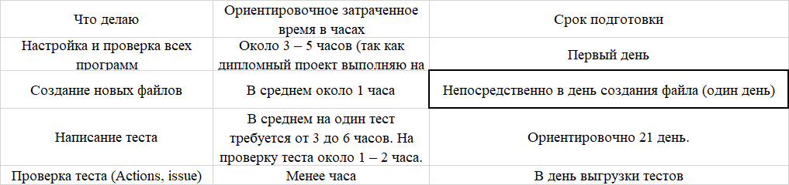

1.	Перечень автоматизируемых сценариев.

1.1	Валидные данные

Номер карты: 4444 4444 4444 4441
Срок действия: 08.2027
ФИО: Ivan Ivanovich Vetrov
CVC 999

1.2 Невалидные данные

Номер карты: 4444 4444 4444 4442
Срок действия: 08.2027
ФИО: Ivan Ivanovich Vetrov
CVC 999

1.3	Позитивные сценарии

1.3.1 Покупка тура дебетовой картой со статусом “APPROVED”: 
Зайти на сайт, ввести валидные данные карты (номер 4444 4444 4444 4441, срок действия 08.2027, ФИО Ivan Ivanovich Vetrov, CVC 999), остальные данные тоже валидные. Нажать «Продолжить». 
Ожидаемый результат: Появляется уведомление «Операция одобрена банком». Запись со статусом в БД «APPROVED».

1.3.2 Покупка тура в кредит: 
Зайти на сайт, выбрать "Купить в кредит", нажать «Продолжить». 
Ожидаемый результат: уведомление об успешном оформлении кредита на тур.

1.3.3 Активные кнопки «Купить» и «Купить в кредит»: 
Переключение между кнопками происходит без ошибок, обе кнопки кликабельны. 

1.4	Негативные сценарии

1.4.1 При оформлении кредита на тур происходит отказ: 
Нажать «Купить в кредит». Ввести валидные данные. Нажать «Продолжить». 
Ожидаемый результат: Уведомление об отказе Банком в выдаче кредита.
Запись со статусом в БД «DECLINED».

1.4.2 Все поля пустые, нет возможности отправить заявку: 
Все поля для заведения заявки остаются не заполненными. Целевое действие: Попробовать нажать «Продолжить». 
Ожидаемый результат: Кнопка не кликабельна. Под всеми полями подсвечена красная надпись о необходимости ввести данные.

1.4.3 Невалидный номер карты, то есть менее 16 цифр: 
Номер карты 4444 4444 4444 444 (15 цифр), срок действия 08.2027, ФИО Ivan Ivanovich Vetrov, CVC 999. Нажать «Продолжить». 
Ожидаемый результат: Кнопка «Продолжить» не кликабельна, под полем красная надпись: «Данное поле обязательно для заполнения. Введите номер карты.» 

1.4.4 Пустое поле "Номер карты": 
Валидные ФИО, срок действия и CVC, номер карты не заполнен. Нажать «Продолжить». 
Ожидаемый результат: Кнопка «Продолжить» не кликабельна. Под полем «Номер карты» красная надпись: «Данное поле обязательно для заполнения. Введите номер карты.» 

1.4.5 CVC менее, чем три цифры: 
Номер карты 4444 4444 4444 444 (15 цифр), срок действия 08.2027, ФИО Ivan Ivanovich Vetrov, CVC 35 (2 цифры). Нажать кнопку «Продолжить». 
Ожидаемый результат: Кнопка «Продолжить» не кликабельна, под полем CVC красная надпись «CVC состоит из 3 цифр».

1.4.6 Пустое поле CVC:
Номер карты 4444 4444 4444 444 (15 цифр), срок действия 08.2027, ФИО Ivan Ivanovich Vetrov, CVC оставить пустым .Нажать кнопку «Продолжить». 
Ожидаемый результат: Кнопка «Продолжить» не кликабельна, под полем CVC красная надпись «CVC является обязательным для заполнения».

1.4.7 ФИО на кириллице, форма выдаёт ошибку: 
Номер карты 4444 4444 4444 444 (15 цифр), срок действия 08.2027, ФИО Иван Иванович Ветров, CVC  999. Целевое действие: Нажать «Продолжить». 
Ожидаемый результат: Кнопка «Продолжить» не кликабельна. Под полем ФИО красная надпись: «ФИО должно быть указано латиницей».

1.4.8 Пустое поле «Фамилия»: 
Ввести данные F_CARD (номер карты 4444 4444 4444 4441, срок действия 08.2027, ФИО Ivan Ivanovich, CVC 999).  Нажать «Продолжить». 
Ожидаемый результат: Кнопка «Продолжить» не кликабельна. Под полем «Фамилия» красная надпись: «Поле “Фамилия” является обязательным для заполнения». 

1.4.9 Пустое поле «Имя»: 
Ввести данные N_CARD (номер карты 4444 4444 4444 4441, срок действия 08.2027, ФИО Ivanovich Vetrov, CVC 999).  Нажать кнопку «Продолжить». 
Ожидаемый результат: Кнопка «продолжить» не кликабельна. Под полем «Имя» красная надпись: «Поле “Имя” обязательно для заполнения.

1.4.10 При оформлении тура невалидной дебетовой картой платёж проходит: 
Нажать «Купить». Ввестиневалидные данные. Нажать «Продолжить». 
Ожидаемый результат: Уведомление об отказе.
Запись со статусом в БД «DECLINED».

2.  Перечень используемых инструментов с обоснованием выбора.
Для написания тестов, автоматизации, запуска и отчётности необходимы следующие программы:  Python, так как обучение по данному языку программирования, Allure, так как данная программа необходима для создания отчётов, Docker для контейнеризации и Docker-Compose для управдения несколькими контейнерами (приложение написано на языке Java, тобы не устанавливать Java SDK на свой компьютер можно воспользоваться Docker/Docker-Compose).
Библиотеки:
1) Pytest для написания и запуска тестов;
2) Requests для отправки HTTP - запросов;
3) Selenium для управления браузром;
4) Allure для создания красивых и понятных HTML - отчётов;
5) Mysql-connector-python для подключения к БД;
6) Python-dotenv для подключения к файлу .env;
7) Flake 8 - анализатор кода.
Docker/Docker-Compose, так как необходимо для работы (приложение написано на языке Java и поэтому необходимо будет установить Java SDK на свой компьютер (или воспользоваться Docker/Docker-Compose)).

3.	Перечень и описание возможных рисков при автоматизации.
Разработчики внесли изменения в интерфейс (например, поменяли кнопки местами). В данном случае тест не пройдёт проверку, даже если приложение работает без проблем. 

4.	Интервальная оценка с учётом рисков в часах.
Настройка и проверка всех программ, создание новых файлов (например, yml), подготовка всех тестов, проверка всех тестов.

5.	План сдачи работ: когда будут готовы автотесты, результаты их прогона.
Ориентировочно на один тест потребуется 2 – 3 дня в зависимости от сложности и «успешного» написания. Перед тем, как приступить к написанию тестов, проверка всех необходимых программ. В конце создание отчёта.

